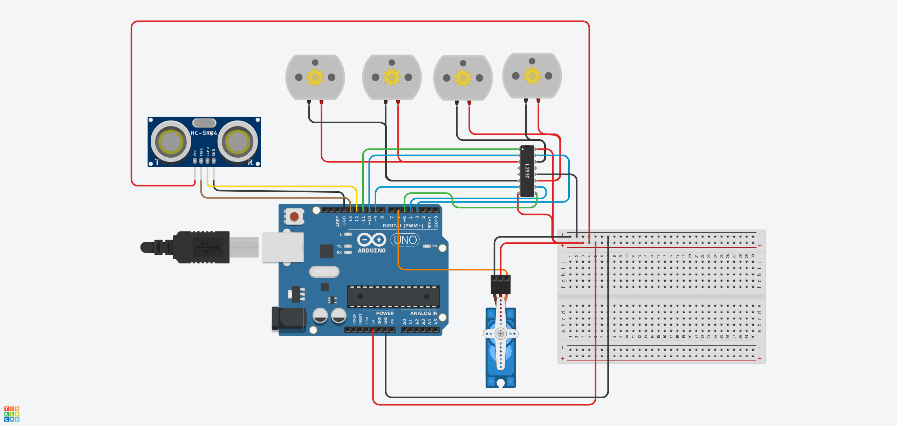

#  Robot Motor Control System

A fully functional Arduino-based motor control system combining four DC motors, a servo motor, and an ultrasonic sensor for obstacle detection and reactive movement. Designed using the L293D motor driver and tested in TinkerCAD Circuits.

## Project Summary
This Arduino-powered robot performs the following:

Drives forward for 30 seconds

Drives backward for 1 minute

Alternates left and right for 1 minute

Monitors for nearby obstacles using an HC-SR04 ultrasonic sensor

If an object is detected within 10 cm, it:

Stops all DC motors

Triggers the servo motor to perform a sweeping action

This system simulates a foundational autonomous behavior logic found in basic robotics and mobile platforms.

---

##  Hardware Used

- Arduino UNO
- L293D Motor Driver IC
- 4x DC Motors
- 1x Servo Motor (SG90 or similar)
- 1x Ultrasonic Sensor (HC-SR04)
- Breadboard + Jumper Wires

---

##  Code 

The code [`robot_motor_control`](./robot_motor_control).

---

## Wiring 

---

